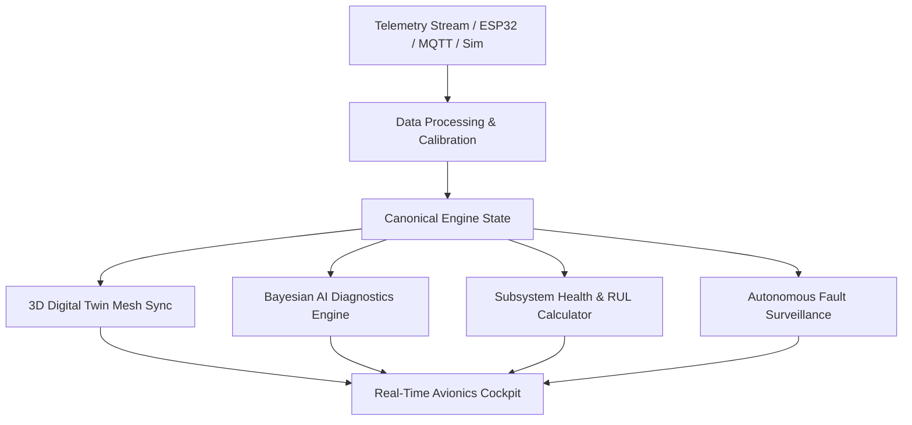

# AeroGuard: AI-Enabled Real-Time Digital Twin for Aero Piston Engines

[](https://reactjs.org/)
[](https://www.typescriptlang.org/)
[](https://vitejs.dev/)
[](https://threejs.org/)
[](https://tailwindcss.com/)

**AeroGuard** is an aerospace-grade real-time digital twin and predictive diagnostics platform designed for aircraft and UAV piston propulsion (specifically calibrated for the **Rotax 916iSc Turbocharged 4-Cylinder Aero Engine**).

It couples physics-based thermodynamic modeling with Bayesian AI anomaly detection, interactive 3D CAD visualization, and simulated Hardware-in-the-Loop (HIL) fault injection.

---

## ✈️ Core Capabilities

1. **Mission Cockpit HUD**: Instant operational surveillance answering:
   - *Is the engine normal?*
   - *Is there an active fault?*
   - *What parameter is abnormal?*
   - *What system is affected?*
   - *What does the AI think?*
   - *Is the condition getting worse?*
2. **Interactive 3D Digital Twin (Three.js)**:
   - Dynamic 3D model with spinning propeller, reciprocating pistons, connecting rods, and crankshaft.
   - Synchronized thermodynamic thermal heatmap (affected cylinders/subsystems glow red during excursions).
   - Component-level inspection for Cylinders, Crankcase, Cooling Circuit, Lubrication Gallery, Spark Plugs, Fuel Injectors, and Exhaust Manifold.
3. **Bayesian AI Anomaly Engine**:
   - Anomaly scoring from `0.00` (Nominal) to `1.00` (Critical Excursion).
   - Real-time Bayesian root-cause likelihood rankings.
   - SHAP feature attributions explaining sensor contributions.
4. **Subsystem Health & RUL Estimation**:
   - Individual degradation algorithms for Combustion, Cooling, Lubrication, Mechanical, Fuel, and Cylinder subsystems.
   - Remaining Useful Life (RUL) estimations in operating flight hours.
5. **Sensor Signal Integrity & Fault Isolation**:
   - Distinguishes between genuine **Engine Mechanical/Thermal Faults** and **Sensor Transducer Faults** (Online, Degraded, Offline).
6. **Automated 6-Scenario Demo Tour**:
   - Complete 9-stage cause-and-effect progression from normal flight to temperature spikes, lubrication loss, vibration, cascading failure, and recovery.
7. **Modular Hardware-Ready Ingestion**:
   - Designed for internal HIL simulation or external telemetry streams via CAN 2.0B, MAVLink, ESP32, Raspberry Pi, and MQTT brokers.

---

## 🏛️ Centralized Pipeline Architecture



---

## 📊 Monitored Avionics Parameters

| Parameter | Nominal Cruise Range | Critical Limit | Subsystem |
|---|---|---|---|
| **Engine Speed (RPM)** | 2200 – 2600 RPM | > 2800 RPM | Mechanical / Governor |
| **Cylinder Head Temp (CHT)** | 150 – 190 °C | > 200 °C | Cooling / Cylinders |
| **Exhaust Gas Temp (EGT)** | 680 – 740 °C | > 780 °C | Combustion / Fuel |
| **Oil Temperature** | 80 – 105 °C | > 118 °C | Lubrication System |
| **Oil Pressure** | 45 – 65 PSI | < 30 PSI | Lubrication Scavenge |
| **Tri-axial Vibration** | 0.4 – 1.2 g | > 2.5 g | Rotating Assemblies |
| **Fuel Flow** | 18 – 26 L/h | > 32 L/h | Fuel Injection |
| **Manifold Pressure (MAP)** | 28 – 32 inHg | > 35 inHg | Turbocharger Boost |

---

## 🚀 Getting Started

### Prerequisites

- **Node.js**: v18+ or v20+
- **npm** or **yarn** / **pnpm**

### Installation

```bash
# Clone repository
git clone https://github.com/lohithramsaik/AEROGUARD.git
cd AEROGUARD

# Install dependencies
npm install

# Start local development server
npm run dev
```

Visit `http://localhost:3000` (or `http://localhost:3001` if port 3000 is occupied).

### Building for Production

```bash
npm run build
```

---

## 🛠️ Tech Stack

- **Framework**: React 18 with TypeScript
- **Bundler**: Vite 5
- **Styling**: Tailwind CSS + Custom Dark Avionics HUD Theme
- **3D Graphics**: Three.js / WebGL
- **Charts & Telemetry**: Recharts & Canvas
- **Icons**: Lucide React

---

## 📄 License

MIT License. Designed for aerospace propulsion research, telemetry analysis, and predictive UAV maintenance.
